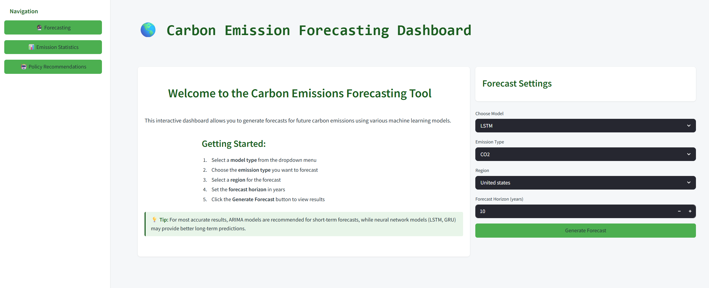
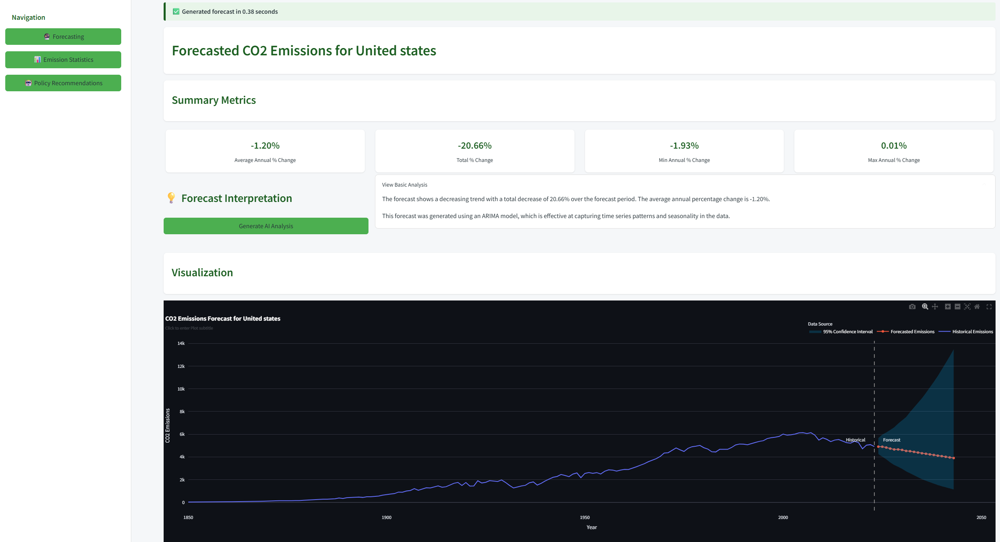
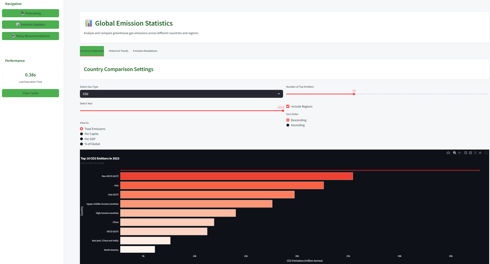
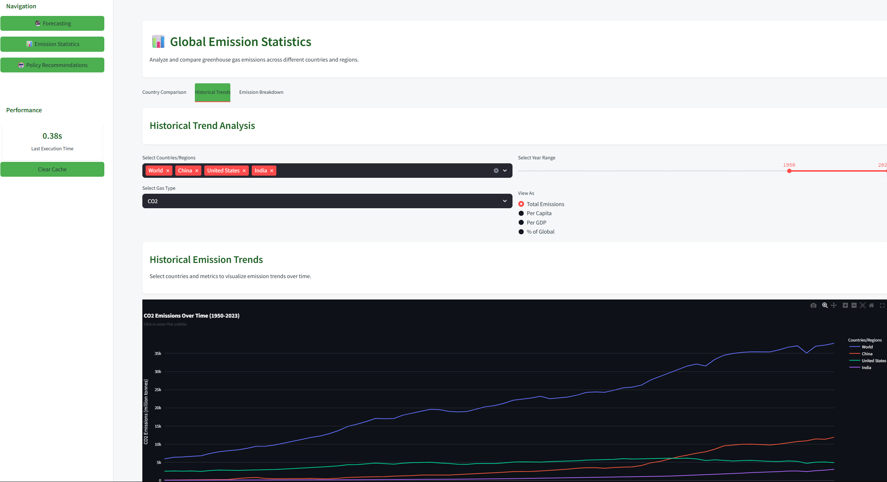
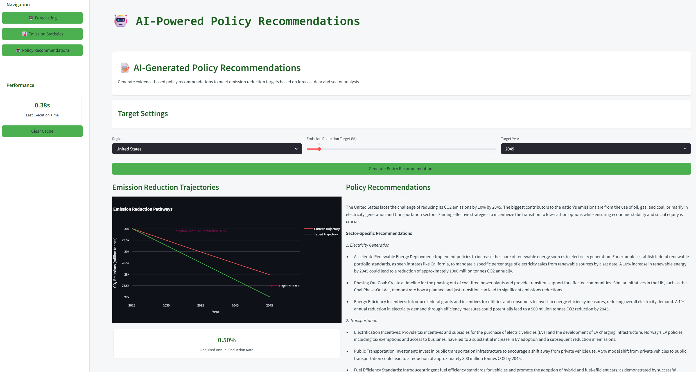

# 🌍 CarbonCast — Carbon Emission Time Series Forecasting and Trend Analysis

**CarbonCast** is an advanced Streamlit dashboard that combines machine learning models and large language models (LLMs) to forecast carbon emissions, analyze historical trends, and generate AI-powered policy recommendations.

---

##  Forecasting Dashboard


##  Forecasting Results


##  Emission Statistics



##  AI Policy Recommendations


## 🚀 Features

- **Forecasting** using LSTM, GRU, ARIMA, or ARIMA+LSTM
- **Interactive Visualizations** for historical emissions and trends
- **Country Comparisons** across gases, regions, and timeframes
- **AI-Powered Insights** using OpenAI GPT for:
  - Emission trend summaries
  - Policy recommendations to meet emission targets


---

## 📦 Project Structure

```
carboncast/
├── dashboard.py             # Main Streamlit app
├── utils.py                 # Model loading, forecasting logic
├── llm_utils.py             # LLM summarization & policy generation
├── llm_integration.py       # Policy recommendation page UI
├── data/
│   ├── raw_data/
│   │   └── owid-co2-data.csv
│   └── processed_data/
│       ├── united_states.csv
│       └── world.csv
├── models/
│   ├── united_states/
│   │   ├── CO2/
│   │   │   ├── LSTM/
│   │   │   ├── GRU/
│   │   │   └── ARIMA/
│   │   └── GHG/
│   └── world/
│       ├── CO2/
│       └── GHG/
├── .env                     # OpenAI API key (not tracked)
├── requirements.txt
└── README.md
```

---

## ⚙️ Setup Instructions

### 🔧 Prerequisites

- Python 3.8+
- pip

### 📥 Installation

```bash
git clone https://github.com/yourusername/carboncast.git
cd carboncast

# (Optional) Create a virtual environment
python -m venv venv
venv\Scripts\activate  # On Windows
# or
source venv/bin/activate  # On macOS/Linux

# Install dependencies
pip install -r requirements.txt
```

### 🔐 API Key Setup

Create a `.env` file in the root directory:

```
OPENAI_API_KEY=your_api_key_here
```

---

## ▶️ Run the App

```bash
streamlit run dashboard.py
```

Open http://localhost:8501 in your browser.

---

## 🧠 AI Features

### 1. Forecast Summarization (LLM)

- Generated by GPT-4 based on model predictions
- Scientific summary, uncertainties, global targets comparison

### 2. Policy Recommendations (LLM)

- Sector-specific policy guidance
- Annual reduction trajectories & visualizations
- Interactive target setting for % reduction and year

---

## 🛠 Development Notes

- Models are loaded dynamically from the `models/` folder using caching
- Forecasting supports caching to avoid recomputation
- AI functions use OpenAI's `chat.completions` API with structured prompts

---

## 📜 License

MIT

---

## 📚 Acknowledgments

- [Our World in Data – CO2 dataset](https://ourworldindata.org/co2-and-other-greenhouse-gas-emissions)
- OpenAI for LLM capabilities
- Streamlit, PyTorch, Statsmodels, Plotly

